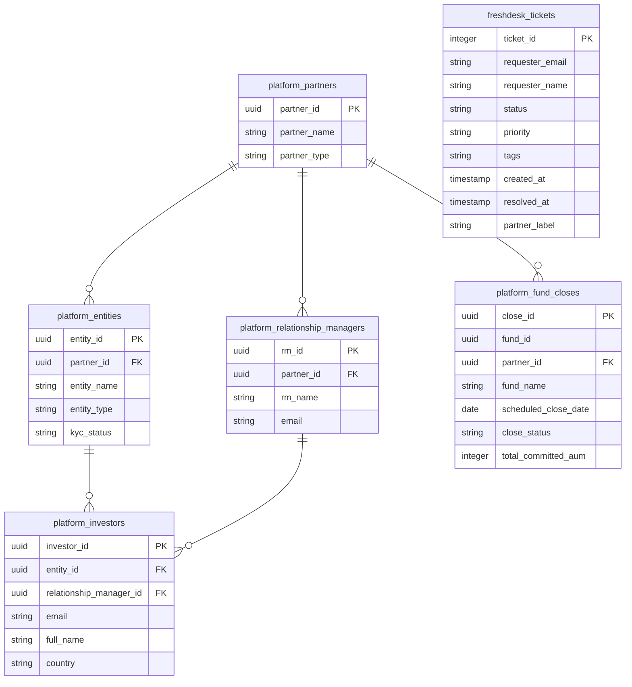
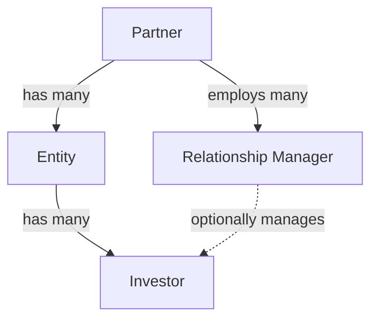

# Data Schema Reference

## Source Tables — How They Link

```mermaid
erDiagram
    platform_partners ||--o{ platform_relationship_managers : " "
    platform_partners ||--o{ platform_entities : " "
    platform_partners ||--o{ platform_fund_closes : " "
    platform_entities ||--o{ platform_investors : " "
    platform_relationship_managers ||--o{ platform_investors : " "

    platform_partners {
        uuid partner_id PK
        string partner_name
        string partner_type
    }

    platform_relationship_managers {
        uuid rm_id PK
        uuid partner_id FK
        string rm_name
        string email
    }

    platform_entities {
        uuid entity_id PK
        uuid partner_id FK
        string entity_name
        string entity_type
        string kyc_status
    }

    platform_investors {
        uuid investor_id PK
        uuid entity_id FK
        uuid relationship_manager_id FK
        string email
        string full_name
        string country
    }

    platform_fund_closes {
        uuid close_id PK
        uuid fund_id
        uuid partner_id FK
        string fund_name
        date scheduled_close_date
        string close_status
        integer total_committed_aum
    }

    freshdesk_tickets {
        integer ticket_id PK
        string requester_email
        string requester_name
        string status
        string priority
        string tags
        timestamp created_at
        timestamp resolved_at
        string partner_label
    }
```

---

## How Partner, Entity, RM and Investor Relate

```mermaid
graph TD
    A[Partner] -->|employs many| B[Relationship Manager]
    A -->|has many| C[Entity]
    C -->|has many| D[Investor]
    B -.->|optionally manages| D
```
